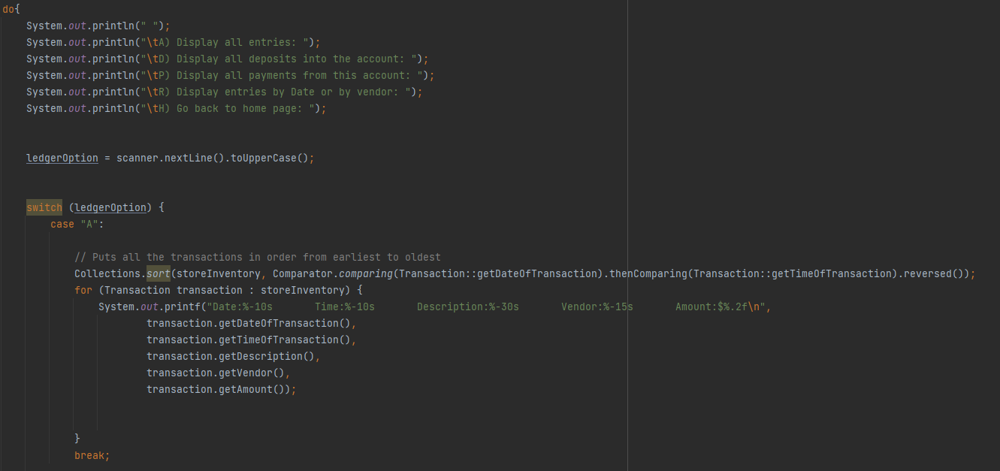

# Capstone One Accounting Ledger 
### ~Selam Nur
https://github.com/selamnur7/CapstoneOne_AccountingLedger/blob/main/src/main/java/com/ps/Main.java
### Description
This project allows the user to store and save the transactions that they do everyday.
The program tracks the time that the transaction was saved, along with the time, the vendor, description of the transaction, and the amount. The features that this program has are:
- Add Deposit
  - 
  * After selecting the add deposit menu, the user is prompted to type the description of 
  the deposit, along with the name of the vendor, and the amount of the deposit 

 
  * When the user completes their deposit the program requests if they
would like to add another deposit or not. If they choose yes, they will be prompted again
the same, if not, they will go back to the main menu
  
  * This code adds the new deposits into the storeInventory arraylist, and 
  writes the new deposits into the transactions.txt file
- Withdrawal/ Payment
  - 
  * Similar to the add deposit menu, this feature requests the description of the payment,
  along with the name of the vendor and the amount of the payment

  * It also saves the new payment into the arraylist and writes to the text file
- Ledger Menu
  -
  * This menu displays options to print all entries, deposits, payments or goes to reports

  * All of the transactions are sorted from earliest to oldest for each option, and cycles through all transactions in the arraylist 
depending on what is being searched for 

  * This menu is when the user requests all the deposits in the transactions arrayList
  * If the user presses h they go back to the main menu, but if they press r, they go to reports

- Reports Menu
  -
  * Reports menu gives you the option to search by this month, last month, this year, last year,
  search by vendor, custom search, or go back to the ledger page

  * This code sorts the transactions from earliest to latest and loops through the arraylist until it finds 
a transaction in this current month

  * Here you can see all of the options that the user is given and the prompts they give to get to the Month to date Report
  * After it gets printed the user can search using another filter, or go back to the ledger page

- Custom Search
  -

  * This is the custom filter that will print out one specific transaction that the user types all the attributes for.
    This can be useful for bank accounts that have been open for years and are trying to keep the scope of the search very small.

  * I found this code the most interesting because I had to compare many different attributes in the Transaction class
along with converting one from a LocalDate data type to an int in order to get the custom search to work. Once I got one of them
down it was easier to do the rest.

## Thanks for viewing my Project!